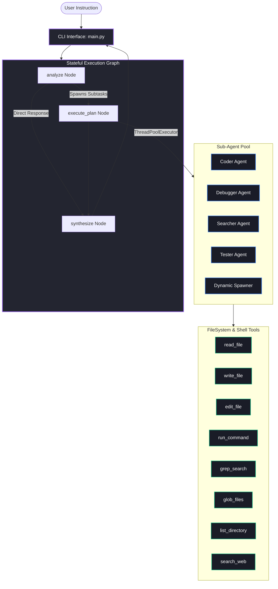
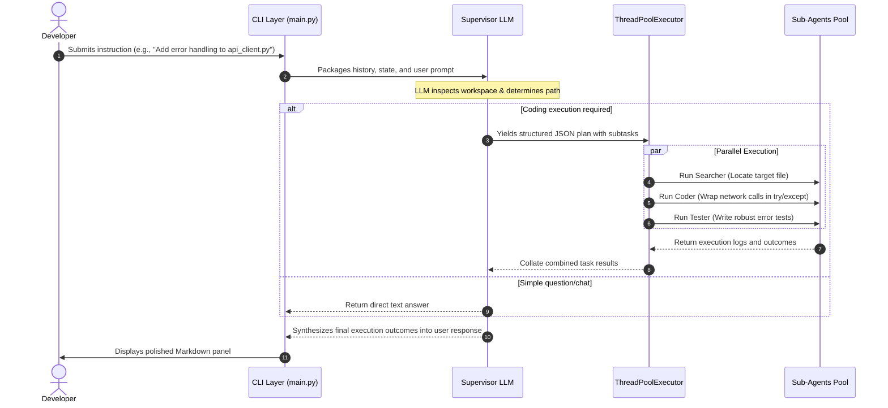

<div align="center">

<pre>
    ____  ____  _________ __  ___ ___ 
   / __ \/ __ \/  _/ ___//  |/  //   |
  / /_/ / /_/ // / \__ \/ /|_/ // /| |
 / ____/ _, _// / ___/ / /  / // ___ |
/_/   /_/ |_/___//____/_/  /_//_/  |_|
</pre>

### *A Stateful Parallel Multi-Agent Orchestration Framework*

[](https://www.python.org/)
[](https://github.com/langchain-ai/langgraph)
[](https://pytest.org/)
[](https://opensource.org/licenses/MIT)
[](#)

<p align="center">
  <strong>Parallelize Code Workflows</strong> • 
  <strong>Stateful Graph Routing</strong> • 
  <strong>Security Sandboxed</strong>
</p>

*Prisma is a multi-agent coding assistant built on top of LangGraph. It intelligently decomposes user-defined natural language requests into parallel subtasks and delegates them to specialized, concurrent sub-agents to accelerate development velocity.*

---

</div>

## 📊 Core Performance & Framework Statistics

Prisma optimizes multi-step developer operations by replacing sequential agent execution with parallel thread pools.

<div align="center">

| Metric / Dimension | Framework Capabilities & Stats | Details |
| :--- | :--- | :--- |
| **Concurrency Scaling** | `ThreadPoolExecutor` (Max 4 Workers) | Runs independent tasks simultaneously |
| **Workflow Acceleration** | **2.0x – 4.0x Speedup** | Drastically cuts overall agent response latency |
| **Agent Taxonomy** | `5` Specialized Roles | Coder, Debugger, Searcher, Tester + Dynamic Spawner |
| **Native Primitives** | `8` High-Fidelity Tools | Whitelisted shell, filesystem operations, and web search |
| **Supported LLMs** | Multi-Provider Configuration | Integrates with Groq, NVIDIA, and OpenRouter |
| **Test Quality** | `57` Automated Tests | Unit and integration suites passing with a 100% rate |

</div>

### ⏱️ Concurrency Timeline (Sequential vs. Parallel Execution)

The diagram below compares how Prisma handles a task requiring file searching, coding, and testing:

```mermaid
gantt
    title Concurrency Performance Profile (Sequential vs Parallel execution)
    dateFormat  X
    axisFormat %s seconds
    
    section Sequential Loop (Total: ~9s)
    Locate Files (Searcher)     :active, seq1, 0, 2
    Modify Code (Coder)          :active, seq2, after seq1, 4
    Author Tests (Tester)        :active, seq3, after seq2, 3
    
    section Prisma Parallel (Total: ~4s)
    Locate Files (Searcher)     :active, par1, 0, 2
    Modify Code (Coder)          :active, par2, 0, 4
    Author Tests (Tester)        :active, par3, 0, 3
```



---

## 📐 Architecture & System Design

Prisma models agent interactions as a stateful, cyclic workflow loop orchestrated by **LangGraph**. The supervisor handles planning and routes tasks to the sub-agent execution pools.

### 🧩 Component Topology



### 🔄 Request-Response Lifecycle



### 💾 Shared State Schema

The LangGraph engine maintains context via a centralized state dictionary, which is updated reducer-style:

```python
class AgentState(TypedDict):
    messages: Annotated[list[BaseMessage], add_messages]  # Full conversation history
    subtasks: list[SubTask]                              # Queue of planned subtasks
    mode: str                                             # Active execution mode ("build" | "plan")
```

| Field | Type | Accumulation | Description |
| :--- | :--- | :--- | :--- |
| `messages` | `list[BaseMessage]` | Append-only (`add_messages`) | Retains conversation logs across turns. |
| `subtasks` | `list[SubTask]` | Overwrite | Re-evaluated by the supervisor on every plan generation. |
| `mode` | `str` | Overwrite | Controls whether subtasks are executed (`build`) or output as JSON (`plan`). |

---

## 🤖 The Sub-Agent Pool

Sub-agents are dynamic, compiled LangChain graph execution pipelines configured with specialized prompts and subsets of tools.

| Agent | Type | Primary Responsibility | Active Tools |
| :--- | :--- | :--- | :--- |
| **`Coder`** | Persistent | Writes, inspects, and refactors source code. | `read_file`, `write_file`, `edit_file`, `run_command`, `grep_search`, `glob_files`, `list_directory` |
| **`Debugger`** | Persistent | Traces stack traces, diagnoses bugs, and repairs errors. | `read_file`, `run_command`, `grep_search`, `glob_files`, `list_directory` |
| **`Searcher`** | Persistent | Locates code files, constructs patterns, and searches web. | `read_file`, `grep_search`, `glob_files`, `list_directory`, `search_web` |
| **`Tester`** | Persistent | Authors unit & integration tests; runs test suites. | `read_file`, `write_file`, `edit_file`, `run_command`, `grep_search`, `glob_files`, `list_directory` |
| **`Spawner`** | Dynamic | Synthesized on-demand to handle atypical tasks (e.g., config setup). | `read_file`, `write_file`, `edit_file`, `run_command`, `grep_search`, `glob_files`, `list_directory` |

> [!NOTE]
> Each sub-agent compiles via LangChain's `create_agent` factory:
> ```python
> def create_sub_agent(model, api_key, base_url, system_prompt, tools):
>     llm = ChatOpenAI(model=model, api_key=api_key, base_url=base_url)
>     return create_agent(model=llm, tools=tools, system_prompt=system_prompt)
> ```

---

## 🛠️ Security-Sandboxed Tool Reference

To ensure safety during execution, all file and shell utilities run with sandbox boundaries.

### Core Tool Signatures

| Tool | Python Signature | Description / Restraints |
| :--- | :--- | :--- |
| `read_file` | `(path: str) -> str` | Returns content (capped at 50,000 chars) within the workspace directory. |
| `write_file` | `(path: str, content: str) -> str` | Creates parents and writes files inside the workspace boundaries. |
| `edit_file` | `(path: str, old_string: str, new_string: str) -> str` | Atomically replaces the first occurrence of the old string. |
| `run_command` | `(command: str) -> str` | Runs whitelisted commands in Windows PowerShell (60s timeout). |
| `grep_search` | `(pattern: str, include: str = None) -> str` | Recursive regex pattern matching, capped at 30 results. |
| `glob_files` | `(pattern: str) -> str` | Recursive file search matching glob filters, capped at 100 paths. |
| `list_directory`| `(path: str = ".") -> str` | Lists files and folders, automatically skipping dotfiles. |
| `search_web` | `(query: str, max_results: int = 5) -> str` | Queries Tavily, Brave, or Google Search engines. |

### 🔒 Sandbox Restraints

1. **Workspace Restriction (`_is_path_within_repo`)**: All file operations (read, write, edit) verify that target paths resolve within the active repository root. Directory-traversal attacks are blocked.
2. **Command Whitelisting**: The `run_command` utility restricts shells to a narrow set of safe administrative and testing commands:
   ```python
   _ALLOWED_COMMANDS = {
       "pytest", "python", "pip", "git", "dir", "ls", "echo", 
       "Get-ChildItem", "Set-Content", "Remove-Item"
   }
   ```

---

## ⚙️ Configuration Reference

Prisma parses environment variables from a `.env` file at runtime. It features multi-provider routing (OpenRouter, NVIDIA, Groq) based on your selected model names.

| Parameter | Environment Variable | Default Value | Description |
| :--- | :--- | :--- | :--- |
| **Supervisor Model** | `SUPERVISOR_MODEL` | `google/gemini-2.5-flash` | LLM model for supervisor analysis and plan synthesis. |
| **Sub-agent Model** | `SUB_AGENT_MODEL` | `google/gemini-2.5-flash` | LLM model used to compile sub-agents. |
| **API Endpoint Key** | Provider-dependent | *(parsed from env)* | Keys parsed: `OPENROUTER_API_KEY`, `NVIDIA_API_KEY`, `GROQ_API_KEY`. |
| **Search Engine Provider** | `SEARCH_PROVIDER` | `tavily` | Engine for the search sub-agent (`tavily`, `brave`, or `google`). |
| **Search API Key** | Provider-dependent | *(parsed from env)* | Keys parsed: `TAVILY_API_KEY`, `BRAVE_API_KEY`, `GOOGLE_API_KEY`. |

---

## 🚀 Installation & Setup

### 1. Prerequisites
- **Python**: Version 3.11 or higher
- **API Keys**: OpenRouter, Groq, or NVIDIA developer account keys.

### 2. Step-by-Step Installation

```bash
# 1. Clone or navigate to the repository
cd c:\Users\spide\Downloads\Projects\prisma-agent

# 2. Initialize a virtual environment
python -m venv .venv

# 3. Activate the environment
# On Windows PowerShell:
.\.venv\Scripts\Activate.ps1
# On Linux/macOS:
source .venv/bin/activate

# 4. Install dependencies
pip install -r requirements.txt
```

### 3. Environment Setup

Create a `.env` file in the root of the project:

```env
# LLM Providers (Provide at least one)
OPENROUTER_API_KEY=your-openrouter-key
NVIDIA_API_KEY=your-nvidia-key
GROQ_API_KEY=your-groq-key

# Search Engine Configurations (Optional)
SEARCH_PROVIDER=tavily
TAVILY_API_KEY=your-tavily-key
```

---

## 💻 CLI Usage

Start the interactive console terminal:

```bash
python main.py
```

### ⌨️ CLI Mode Hotkey

> [!TIP]
> Press the **`TAB`** key in the prompt to toggle between modes:
> - **`BUILD` mode**: Supervisor generates the plan and executes it using parallel sub-agents immediately.
> - **`PLAN` mode**: Supervisor generates and displays the structured plan JSON, allowing you to review actions before committing code changes.

### Console Command Suite

| Command | Action |
| :--- | :--- |
| `/help` | Lists available console commands. |
| `/clear` | Resets conversation memory. |
| `/quit` | Terminates the Prisma CLI session. |

### Visual Terminal Previews

```
┌────────────────────────────────────────────────────────┐
│                        Welcome                         │
│                        PRISMA                          │
│                                                        │
│  Stateful, parallel sub-agent workflows for developers │
│                                                        │
│  Type your request below. Press [TAB] to toggle mode.  │
│  Use /help for commands.                               │
└────────────────────────────────────────────────────────┘
```

#### Plan-Only Output Mode (Review mode)
```
prisma [plan] > Add logging to main.py
```
```json
{
  "plan": "Inject logging configs and info calls in main.py entrypoint",
  "subtasks": [
    {
      "agent_type": "coder",
      "description": "Import logging and configure basicConfig, then add execution logs",
      "relevant_files": ["main.py"]
    }
  ]
}
```

---

## 🧪 Testing Suite

Prisma is backed by a unit and integration test suite written with `pytest`. 

### Running Tests

```bash
# Set test mode (bypasses tool sandboxes to allow temporary directories)
$env:PRISMA_TEST_MODE="1"

# Run full test suite
pytest tests/ -v

# Run individual tool tests
pytest tests/test_tools.py -v
```

### Test Directory Layout

```
tests/
├── test_cli_ux.py       # Validates CLI input/output formatting & Rich panels
├── test_integration.py  # End-to-end mocked execution graphs
├── test_state.py        # Asserts State dictionary schema and updates
├── test_sub_agents.py   # Verifies sub-agent factories & prompt parameters
└── test_tools.py        # Validates file/shell tools & whitelisting
```

---

## 🛠️ Development & Extending Prisma

### 1. Registering a New Sub-Agent

Create a new file in `agent/sub_agents/`:

```python
# agent/sub_agents/refactorer.py
from .base import create_sub_agent
from ..tools import TOOLS

REFACTORER_PROMPT = "You are a refactoring agent. Review code for clean-code patterns..."

def create_refactorer(model, api_key, base_url):
    return create_sub_agent(
        model=model, api_key=api_key, base_url=base_url,
        system_prompt=REFACTORER_PROMPT, tools=TOOLS
    )
```

Register it in `agent/supervisor.py`:

```diff
  from .sub_agents.tester import create_tester
+ from .sub_agents.refactorer import create_refactorer

  AGENT_FACTORY = {
      "coder": lambda: create_coder(SUB_AGENT_MODEL, API_KEY, BASE_URL),
      "debugger": lambda: create_debugger(SUB_AGENT_MODEL, API_KEY, BASE_URL),
      "searcher": lambda: create_searcher(SUB_AGENT_MODEL, API_KEY, BASE_URL),
      "tester": lambda: create_tester(SUB_AGENT_MODEL, API_KEY, BASE_URL),
+     "refactorer": lambda: create_refactorer(SUB_AGENT_MODEL, API_KEY, BASE_URL),
  }
```

### 2. Registering a New Tool

Create your tool inside `agent/tools.py`:

```python
@tool
def calculate_complexity(path: str) -> str:
    """Calculates code complexity metrics of a given file."""
    # ... logic here ...
    return "Complexity: Low"
```

Add your tool to the exports array:

```diff
- TOOLS = [read_file, write_file, edit_file, run_command, grep_search, glob_files, list_directory, search_web]
+ TOOLS = [read_file, write_file, edit_file, run_command, grep_search, glob_files, list_directory, search_web, calculate_complexity]
```

---

## 🔍 Troubleshooting

| Symptom | Probable Cause | Corrective Action |
| :--- | :--- | :--- |
| `NVIDIA_API_KEY` (or other key) not set | The API key was not loaded from the `.env` file | Double-check `.env` syntax; run `set` in cmd or `$env` in powershell to verify keys are visible. |
| Tool failures inside tests | Sandbox checks blocked access to pytest temporary paths | Run tests with environment flag `$env:PRISMA_TEST_MODE="1"`. |
| Commands block or time out | Command run is not whitelisted, or has interactive prompts | Ensure command is in `_ALLOWED_COMMANDS` and does not prompt for user input. |
| `String not found` in `edit_file` | The `old_string` was not found or is ambiguous | Double-check text encoding or provide surrounding context for unique matching. |

---

<div align="center">
  <sub>Built with Python, LangGraph, and LangChain</sub><br>
  <sub>License: MIT • Copyright © 2026</sub>
</div>
